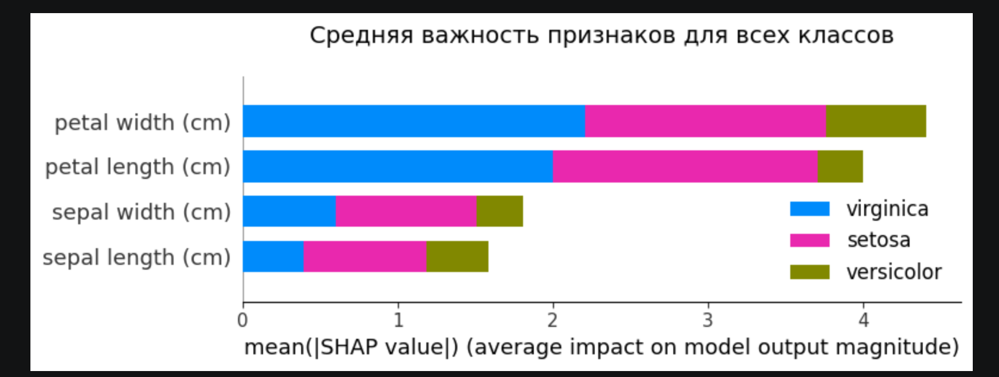
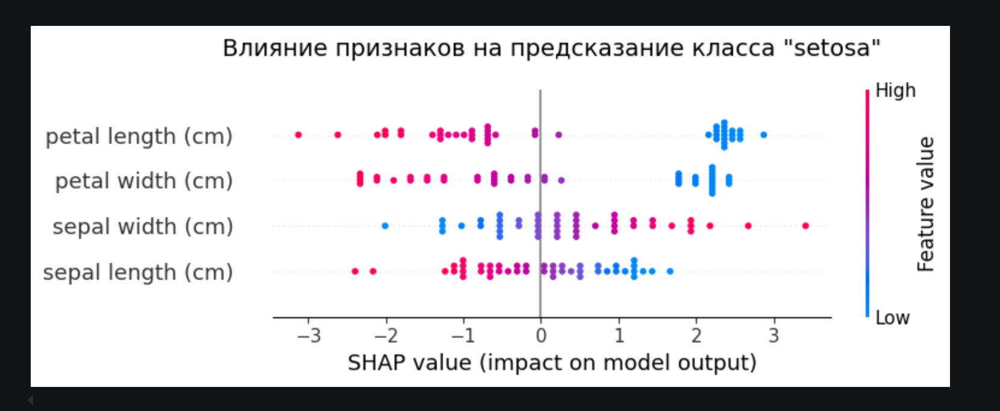
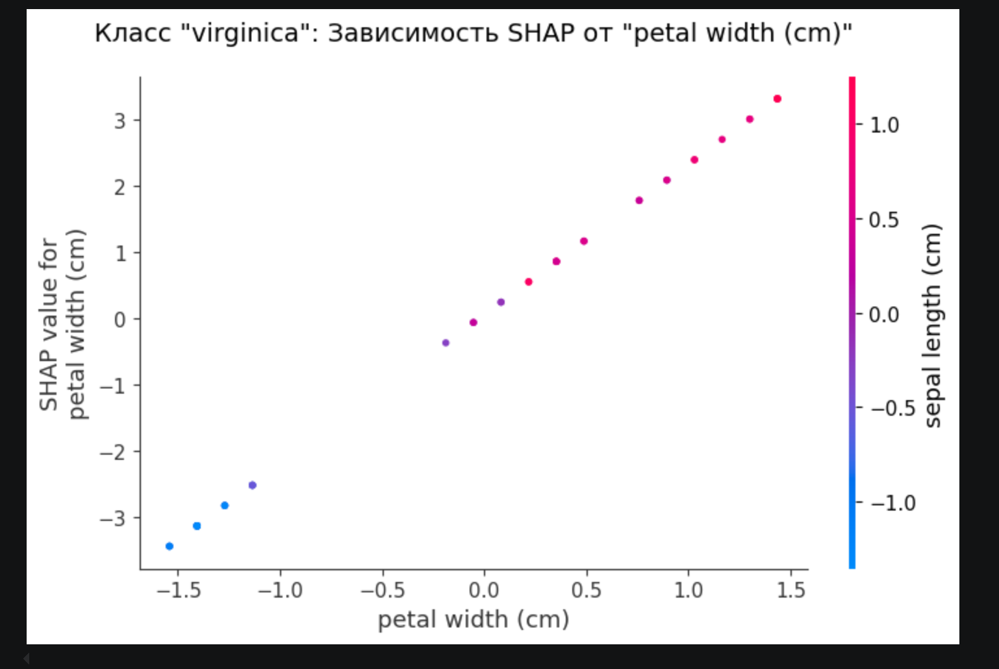

Это **SHAP summary plot (beeswarm plot)** — еще более детальный график, чем предыдущий. Если прошлый график показывал **среднюю** важность, то этот показывает **направление и силу влияния** каждого конкретного признака для *каждого конкретного цветка* в вашем наборе данных при предсказании **класса "Setosa"**.

Давайте разберем, как это читать.

### 1. Оси и цвета

*   **Ось Y (слева):** Признаки цветка (длина/ширина лепестка/чашелистика).
*   **Ось X (снизу):** **SHAP value**.
    *   **0 (нулевая линия):** Признак не влияет на предсказание.
    *   **> 0 (вправо):** Признак **увеличивает** вероятность того, что цветок — Setosa.
    *   **< 0 (влево):** Признак **уменьшает** вероятность того, что цветок — Setosa (то есть "голосует" за другие классы).
*   **Цвет справа:**
    *   **Красный (High):** Высокое числовое значение признака.
    *   **Синий (Low):** Низкое числовое значение признака.

### 2. Как читать этот график: "Логика модели в картинках"

Давайте посмотрим на строки по порядку (сверху вниз, от самого важного признака к менее важному).

#### Строка 1: `petal length (cm)` (Длина лепестка) — **Самый важный признак для Setosa**
Посмотрите на разброс точек:
*   **Слева (отрицательные SHAP):** Точки **красные**. Это значит: *Если у цветка ДЛИННЫЙ лепесток (High), модель резко снижает вероятность того, что это Setosa* (точки уходят далеко влево).
*   **Справа (положительные SHAP):** Точки **синие**. Это значит: *Если у цветка КОРОТКИЙ лепесток (Low), модель сильно уверена, что это Setosa* (кучка синих точек справа).

**Вывод:** Короткие лепестки -> Setosa. Длинные лепестки -> Не Setosa.

#### Строка 2: `petal width (cm)` (Ширина лепестка) — **Очень похожая логика**
*   **Слева:** Красные точки (широкий лепесток) — снижают вероятность Setosa.
*   **Справа:** Синие точки (узкий лепесток) — повышают вероятность Setosa.

**Вывод:** У Setosa лепестки узкие и короткие (это правда).

#### Строка 3: `sepal width (cm)` (Ширина чашелистика) — **Обратная логика**
Здесь картина перевернута по сравнению с лепестками:
*   **Слева:** Синие точки (узкий чашелистик) — снижают вероятность Setosa.
*   **Справа:** Красные точки (широкий чашелистик) — увеличивают вероятность Setosa.

**Вывод:** Широкие чашелистики характерны для Setosa.

#### Строка 4: `sepal length (cm)` (Длина чашелистика) — **Слабый признак**
Разброс точек относительно небольшой. Можно заметить, что синие точки (короткие чашелистики) чаще уходят влево (не Setosa), а красные (длинные) — чуть вправо.

### 3. Итог (как модель "думает")

Модель определяет цветок как **Setosa** следующим образом:
1.  **Главный критерий:** Должен быть **ОЧЕНЬ КОРОТКИЙ** лепесток (синие точки далеко справа в первой строке).
2.  **Второй критерий:** Должен быть **УЗКИЙ** лепесток (синие точки справа во второй строке).
3.  **Дополнительный критерий:** Чашелистик должен быть **ШИРОКИМ** (красные точки справа в третьей строке).

### Почему это выглядит именно так?

Это 100% соответствует реальным биологическим данным цветов ириса. Вид **Setosa** действительно имеет самые короткие и узкие лепестки среди всех трех видов. Поэтому когда модель видит короткий лепесток — она ставит метку Setosa. Когда видит длинный — говорит "нет, это не Setosa".

Этот график помогает вам **доверять** модели, показывая, что она использует логичные физические признаки, а не "гадает на кофейной гуще".

Вот подробное описание этого графика и инструкция, как его читать и интерпретировать.

### Что это за график?

Это **SHAP summary plot** (график суммарной важности признаков). Он используется в машинном обучении, чтобы понять, какие характеристики (признаки) данных больше всего влияют на предсказания модели.

В данном случае модель обучалась на **датасете Iris** (цветы ириса) для задачи **мультиклассовой классификации** (разделение на 3 вида: Setosa, Versicolor, Virginica).

### Как устроен график (ось Y и ось X)

1.  **Ось Y (вертикальная, слева):**
    *   Здесь перечислены **признаки**, по которым модель оценивает цветок.
    *   Сверху вниз они расположены **от самых важных к наименее важным**.
    *   *Признаки:* ширина лепестка (petal width), длина лепестка (petal length), ширина чашелистика (sepal width), длина чашелистика (sepal length).

2.  **Ось X (горизонтальная, внизу):**
    *   Показывает **среднюю величину влияния признака** на предсказания модели (средний модуль значения SHAP).
    *   Чем длиннее полоска идет вправо, тем сильнее этот признак влияет на ответ модели (выше важность).

3.  **Цвета (легенда справа):**
    *   Полоски разноцветные. Каждый цвет показывает вклад признака в предсказание **для конкретного класса** (вида ириса):
        *   **Синий (Blue):** Virginica (Виргинский)
        *   **Розовый (Pink):** Setosa (Щетинистый)
        *   **Оливковый (Olive):** Versicolor (Разноцветный)

### Как понимать этот график (интерпретация)?

#### 1. Ранжирование важности
Посмотрите на длину полосок:
*   **petal width (cm)** — самый важный признак (самая длинная полоса). Без него модель бы сильно ошибалась.
*   **petal length (cm)** — чуть менее важен, но тоже критичен.
*   **sepal width (cm)** и **sepal length (cm)** — имеют небольшое значение. Модель практически не опирается на них, чтобы различить виды ирисов.

Это **абсолютно верно** для датасета Iris. Длина и ширина лепестков действительно отлично разделяют сорта, а размеры чашелистиков часто пересекаются.

#### 2. Детальный анализ по классам
То, что полоски "разноцветные", говорит о том, что **каждый признак важен для предсказания всех трех видов**.

Посмотрите на верхнюю полоску (`petal width`):
*   Она начинается с синего. Значит, ширина лепестка — самый важный фактор, чтобы отличить Virginica от других.
*   Потом идет розовый (Setosa). Ширина лепестка также важна для распознавания Setosa.
*   В конце оливковый (Versicolor).

Тот факт, что все три цвета присутствуют в каждой полоске (примерно равномерно), означает, что модель использует **один и тот же признак** для различения всех трех классов по очереди.

### Простой пример «на пальцах»

Представьте, что модель — это детектив, который определяет сорт цветка.

*   График говорит детективу: **«Сначала измерь ширину лепестка (самая длинная полоска). Это скажет тебе 90% информации. Если не уверен, измерь длину лепестка (вторая по длине полоска). Игнорируй размеры чашелистика почти полностью».**

### Почему этот график выглядит «ок»?
Потому что **ширина лепестка** (petal width) действительно является лучшим отличительным признаком для ирисов. У Setosa она маленькая, у Versicolor средняя, у Virginica большая. На графике мы видим, что этот признак (верхняя строка) наиболее «тяжелый» и вносит самый большой вклад в средний итог.

Это **SHAP dependence plot** (график зависимости SHAP).

Он отвечает на очень конкретный вопрос: **"Как именно ширина лепестка влияет на предсказание класса Virginica?"** — и показывает, меняется ли это влияние в зависимости от другого признака (в данном случае длины чашелистика).

Давайте разберем его по элементам.

### 1. Оси и что они значат

*   **Ось X (горизонтальная):** `petal width (cm)` — это значение **самого признака**. Вы видите числа от -1.5 до +1.5. Это не сантиметры в чистом виде, а **стандартизированные значения** (как далеко значение от среднего). Реальные значения ширины лепестка у Virginica обычно около 1.5–2.5 см.
*   **Ось Y (вертикальная):** `SHAP value for petal width (cm)` — это **влияние** ширины лепестка на предсказание класса Virginica. Если значение Y > 0, признак *увеличивает* вероятность класса Virginica. Если Y < 0, признак *уменьшает* вероятность.
*   **Цвет справа:** `sepal length (cm)` — это **второй признак**, который мы используем для окрашивания точек. Красный = высокая длина чашелистика, Синий = низкая длина чашелистика.

### 2. Как читать этот график

#### Шаг 1. Смотрим на основную линию (тренд)
Точки образуют практически идеальную диагональную линию, идущую снизу вверх. Это значит:
*   **Чем шире лепесток (ось X уходит вправо), тем выше его вклад в предсказание Virginica (ось Y растет).**
*   Очень широкие лепестки (справа) заставляют модель быть **очень уверенной**, что это Virginica.
*   Узкие лепестки (слева) **сильно уменьшают** вероятность Virginica.

#### Шаг 2. Смотрим на цвет точек (взаимодействие признаков)
Обратите внимание: все точки слева (на оси X < 0) — **синие**, а все точки справа (X > 0) — **красные**.
Это означает, что в вашем наборе данных **широкие лепестки часто сопровождаются длинными чашелистиками, а узкие лепестки — короткими чашелистиками**.

**Что это говорит о модели?**
Модель использует ширину лепестка как главный двигатель предсказания. Длина чашелистика здесь играет роль *сопутствующего фактора*, но, судя по тому, что точки лежат на одной прямой, **взаимодействие** между шириной лепестка и длиной чашелистика для класса Virginica слабое. То есть, независимо от того, длинный чашелистик или короткий, зависимость SHAP от ширины лепестка остается линейной и одинаковой.

### 3. Итог (простыми словами)

Этот график говорит вам:
> **"Чтобы модель предсказала 'Virginica', самый важный признак — это ширина лепестка. Чем она больше, тем выше шанс. При этом, если у цветка широкий лепесток, у него, скорее всего, и чашелистик длинный (красные точки). Но именно ширина лепестка является главным драйвером решения."**

### Почему он выглядит именно так?
В реальности цветы **Virginica** имеют самую большую ширину лепестков (около 1.8-2.5 см) среди всех трех видов. Поэтому модель выучила жесткое правило: *"Широкий лепесток = Virginica"*.

*   **Слева (синие):** Цветы с узкими лепестками — это почти наверняка Setosa или Versicolor. Модель снижает вероятность Virginica (отрицательный SHAP).
*   **Справа (красные):** Цветы с очень широкими лепестками — это Virginica. Модель повышает вероятность (положительный SHAP).

Это очень **"чистый"** график, что говорит о том, что модель хорошо обучилась и датасет легко разделим по этому признаку.

